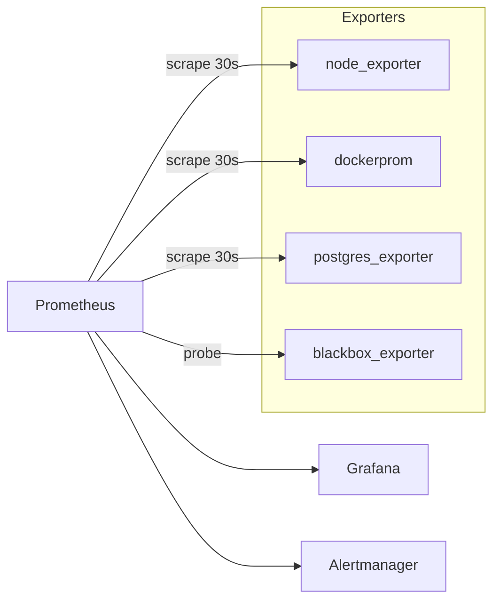
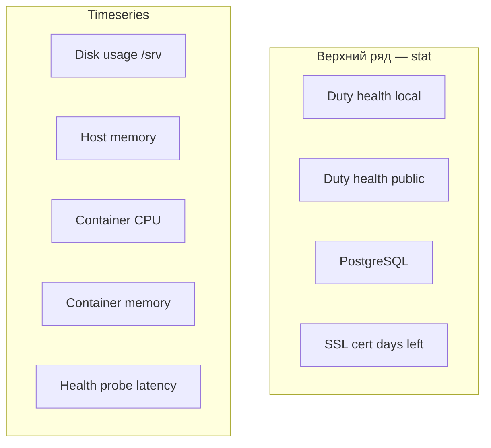

# Справочник метрик мониторинга Duty (NAS / OMV7)

Подробное описание **панелей Grafana**, метрик Prometheus и алертов. Начните с дашборда **Duty Overview** — он собирает ключевые показатели в одном месте.

---

## Как устроен сбор данных



1. **Prometheus** каждые **30 секунд** (`scrape_interval`) опрашивает exporters и сохраняет временные ряды (timestamp + значение + labels).
2. **Grafana** читает Prometheus как datasource и строит графики по **PromQL**-запросам.
3. **Alertmanager** получает срабатывания правил из `prometheus/alerts/duty.yml` (проверка каждые 30s, `evaluation_interval`).

Каждая метрика имеет **имя**, **labels** (метки) и **значение**. **Job** (`job="docker"`) — имя задачи scrape в `prometheus.yml`. **Instance** — адрес target или URL probe.

| Job | Exporter | Что мониторит |
|-----|----------|---------------|
| `prometheus` | сам Prometheus | здоровье TSDB, scrape |
| `node` | node_exporter | хост NAS (CPU, RAM, диск, сеть) |
| `docker` | dockerprom | Docker-контейнеры (CPU, RAM, I/O) |
| `postgres` | postgres_exporter | PostgreSQL `duty_schedule` |
| `blackbox_duty_http` | blackbox_exporter | HTTP health внутри LAN |
| `blackbox_duty_https` | blackbox_exporter | HTTPS health + SSL снаружи |

---

## Dashboard «Duty Overview»

| | |
|---|---|
| **Файл** | `grafana/provisioning/dashboards/json/duty-overview.json` |
| **UID** | `duty-overview` |
| **Обновление** | каждые **30 s** (как scrape Prometheus) |
| **Интервал по умолчанию** | последние **6 часов** |
| **Datasource** | Prometheus |

**Раскладка:** верхний ряд — четыре **stat**-панели (текущее состояние). Ниже — **timeseries** (история за выбранный период). Ссылка «Duty production» ведёт на https://duty-w.ru.



---

### Duty health (local)

| | |
|---|---|
| **Тип панели** | Stat (одно число, фон по цвету) |
| **Источник** | Blackbox Exporter, job `blackbox_duty_http` |

**PromQL:**

```promql
probe_success{job="blackbox_duty_http", instance="http://duty-nginx/api/health"}
```

**Метрики:**

| Метрика | Тип | Смысл |
|---------|-----|--------|
| `probe_success` | gauge (0 или 1) | `1` — probe успешен, `0` — ошибка (таймаут, не 200, DNS, …) |

**Labels в запросе:** `job="blackbox_duty_http"`, `instance` — URL probe (не адрес blackbox).

**Что показывает панель:** крупная надпись **UP** (зелёный фон) или **DOWN** (красный). Берётся последнее ненулевое значение (`lastNotNull`). График миниатюры отключён — только статус «сейчас».

**Как работает probe:** Prometheus каждые 30 s просит blackbox выполнить GET `http://duty-nginx/api/health` (модуль `http_2xx` в `blackbox.yml`: ожидается HTTP **200**, редиректы разрешены). Путь: blackbox (сеть `duty-proxy`) → `duty-nginx` → `api:3000` → `{ "status": "ok" }` без обращения к PostgreSQL.

**Интерпретация:**

| Значение | Смысл |
|----------|--------|
| UP | nginx и API отвечают внутри Docker на NAS |
| DOWN | упал `duty-nginx`, `api`, сеть `duty-proxy` или blackbox не достучался до nginx |

**Связанный алерт:** `DutyHealthFailed` — `probe_success{job=~"blackbox_duty.*"} == 0` дольше **2 мин** (срабатывает и для local, и для public).

**Сравнение с public:** если local **DOWN**, проблема **внутри** Duty на NAS. Если local **UP**, а public **DOWN** — смотреть NPM, роутер, DNS, SSL снаружи.

---

### Duty health (public HTTPS)

| | |
|---|---|
| **Тип панели** | Stat |
| **Источник** | Blackbox Exporter, job `blackbox_duty_https` |

**PromQL:**

```promql
probe_success{job="blackbox_duty_https", instance="https://duty-w.ru/api/health"}
```

**Метрики:** та же `probe_success` (0/1), другой job и URL.

**Что показывает панель:** **UP** / **DOWN** для **внешнего** пользовательского пути — так же, как браузер с интернета.

**Как работает probe:** GET `https://duty-w.ru/api/health` (модуль `http_2xx_ssl`: обязателен TLS, сертификат проверяется, `insecure_skip_verify: false`). Цепочка: DNS → интернет → роутер → NPM (:443) → `duty-nginx` → API.

**Интерпретация:**

| Значение | Типичная причина |
|----------|------------------|
| UP | публичный сайт и HTTPS доступны |
| DOWN | истёк SSL, NPM down, DNS, роутер, WAN, или Duty внутри NAS (часто падает и local) |

**Связанный алерт:** `DutyHealthFailed` (общий с local).

---

### PostgreSQL

| | |
|---|---|
| **Тип панели** | Stat |
| **Источник** | postgres_exporter, job `postgres` |

**PromQL:**

```promql
pg_up
```

**Метрики:**

| Метрика | Тип | Смысл |
|---------|-----|--------|
| `pg_up` | gauge (0 или 1) | `1` — exporter подключился к БД, `0` — нет |

**Что показывает панель:** **UP** / **DOWN** — доступность PostgreSQL `duty_schedule` с точки зрения `postgres_exporter` (сеть `duty-internal`, контейнер `db`).

**Как работает:** при каждом scrape exporter выполняет лёгкий запрос к `postgresql://duty:***@db:5432/duty_schedule`. Это **не** health приложения — только жива ли БД и корректны ли credentials.

**Интерпретация:** `0` при работающем Duty — контейнер `db` остановлен, сеть `duty-internal`, неверный пароль в `.env` monitoring.

**Связанный алерт:** `PostgresDown` — `pg_up == 0` дольше **1 мин**.

**Важно:** панель «Duty health» может быть UP, пока PostgreSQL DOWN — `/api/health` БД не проверяет. Реальные запросы приложения при этом будут падать.

---

### SSL cert days left (duty-w.ru)

| | |
|---|---|
| **Тип панели** | Stat |
| **Единица** | дни (`d`) |
| **Источник** | Blackbox Exporter, job `blackbox_duty_https` |

**PromQL:**

```promql
(probe_ssl_earliest_cert_expiry{job="blackbox_duty_https"} - time()) / 86400
```

**Метрики:**

| Метрика | Тип | Смысл |
|---------|-----|--------|
| `probe_ssl_earliest_cert_expiry` | gauge (Unix timestamp) | момент истечения **самого раннего** сертификата в TLS-цепочке (`Not After`) |
| `time()` | функция PromQL | текущее время Prometheus (секунды с эпохи) |

**Формула:** `(expiry_timestamp - now) / 86400` → **дней до истечения** (дробное число, например `42.3`).

**Что показывает панель:** одно число — сколько дней осталось до окончания сертификата для `duty-w.ru`. Цвет по порогам:

| Дней | Цвет |
|------|------|
| &lt; 7 | красный |
| 7–14 | оранжевый |
| ≥ 14 | зелёный |

График отключён — только актуальное значение.

**Как работает:** при HTTPS-probe blackbox получает цепочку TLS (листовой + промежуточный Let's Encrypt), для каждого сертификата читает `Not After`, записывает **минимум** — «earliest» в названии метрики. Обновляется каждые 30 s; значение **стабильно** убывает (~1 день/сутки), пока NPM не перевыпустит cert — тогда скачок **~+90 дней**.

**Интерпретация:**

| Ситуация | Действие |
|----------|----------|
| 60–90 дней | норма после renew Let's Encrypt через NPM |
| &lt; 14 дней | проверить автообновление в NPM, DNS, проброс 80/443 |
| &lt; 7 дней | срочный renew в NPM |
| ≤ 0 или «No data» | cert истёк или HTTPS probe не проходит — смотреть также «Duty health (public HTTPS)» |

**Связанный алерт:** `SSLCertExpiringSoon` — &lt; **14** дней дольше **1 ч** (то же выражение, что на панели).

**Local HTTP-probe** (`blackbox_duty_http`) этой метрики **не даёт** — там нет TLS.

---

### Disk usage /srv

| | |
|---|---|
| **Тип панели** | Time series (график) |
| **Единица** | проценты (0–100 %) |
| **Источник** | node_exporter, job `node` |

**PromQL:**

```promql
(1 - node_filesystem_avail_bytes{fstype!~"tmpfs|overlay|squashfs", mountpoint=~"/srv.*|/host/root/srv.*"}
  / node_filesystem_size_bytes{fstype!~"tmpfs|overlay|squashfs", mountpoint=~"/srv.*|/host/root/srv.*"}) * 100
```

**Метрики:**

| Метрика | Тип | Смысл |
|---------|-----|--------|
| `node_filesystem_avail_bytes` | gauge (байты) | свободное место на разделе |
| `node_filesystem_size_bytes` | gauge (байты) | полный размер раздела |

**Labels:** `device`, `fstype`, `mountpoint`. На OMV mountpoint часто `/host/root/srv/...` — фильтр покрывает и `/srv.*`, и `/host/root/srv.*`. Исключены tmpfs, overlay, squashfs.

**Что показывает панель:** **занятость диска в %** по каждому разделу под `/srv` — HDD, где лежат Docker, данные Duty, NPM. Легенда: `{{ mountpoint }}`. Пороги на графике: зелёный → оранжевый с **85 %** → красный с **95 %**.

**Как работает:** node_exporter вызывает statfs() на смонтированных ФС **хоста NAS** (не внутри контейнера Duty).

**Интерпретация:** рост — загрузки в чат (`uploads`), логи, образы Docker, snapshots OMV. Это **весь NAS disk /srv**, не отдельный volume контейнера.

**Связанные алерты:** `DiskSpaceLow` (&lt; **15 %** свободно 10 m), `DiskSpaceCritical` (&lt; **5 %** 5 m) — в алертах считается **доля свободного**, формула обратная панели.

---

### Host memory

| | |
|---|---|
| **Тип панели** | Time series |
| **Единица** | проценты (0–100 %) |
| **Источник** | node_exporter, job `node` |

**PromQL:**

```promql
(1 - node_memory_MemAvailable_bytes / node_memory_MemTotal_bytes) * 100
```

**Метрики:**

| Метрика | Тип | Смысл |
|---------|-----|--------|
| `node_memory_MemTotal_bytes` | gauge | установленная RAM NAS |
| `node_memory_MemAvailable_bytes` | gauge | сколько памяти можно выделить без swap (cache + reclaimable) |

**Что показывает панель:** **доля занятой RAM всего NAS** — одна линия «RAM used». Пороги: оранжевый **80 %**, красный **90 %**.

**Как работает:** данные из `/proc/meminfo` хоста. `MemAvailable` точнее, чем `MemFree`, для оценки давления на память.

**Интерпретация:** на NAS 4–8 GB рост дают NPM, PostgreSQL, Grafana, Docker. Постоянно &gt; 90 % — риск **OOM killer** для контейнеров. Это **хост целиком**, не разбивка по контейнерам (для контейнеров — панель «Container memory»).

**Связанный алерт:** `HighMemory` — &gt; **90 %** дольше **10 мин**.

---

### Container CPU (dockerprom)

| | |
|---|---|
| **Тип панели** | Time series |
| **Единица** | `percentunit` (доля одного CPU: 0.5 = 50 % одного ядра) |
| **Источник** | dockerprom, job `docker` |

**PromQL:**

```promql
sum by (container_label_com_docker_compose_project, container_label_com_docker_compose_service, name) (
  rate(container_cpu_user_total[5m]) + rate(container_cpu_system_total[5m])
)
```

**Метрики:**

| Метрика | Тип | Смысл |
|---------|-----|--------|
| `container_cpu_user_total` | counter (секунды CPU) | user space процессов контейнера |
| `container_cpu_system_total` | counter (секунды CPU) | kernel space от имени контейнера |

**Labels в легенде:** `project/service` из Compose (`duty-schedule-backend/nginx`, `monitoring/prometheus`, …) и `name` контейнера.

**Что показывает панель:** **средняя загрузка CPU за 5 мин** по каждому контейнеру. Counter сам по себе только растёт — нужен `rate(...[5m])`. Легенда в режиме таблицы.

**Как работает:** dockerprom читает cgroup v2 (`/sys/fs/cgroup`) на OMV с containerd snapshotter. На 4-ядерном NAS сумма всех линий теоретически до **4.0** (400 % одного ядра эквивалентно 4 ядрам).

**Интерпретация:** всплески у `api` — HTTP-запросы; у `db` — запросы к PostgreSQL; у `prometheus` / exporters — scrape. Отдельного алерта по CPU нет.

---

### Container memory

| | |
|---|---|
| **Тип панели** | Time series |
| **Единица** | байты |
| **Источник** | dockerprom, job `docker` |

**PromQL:**

```promql
container_memory_usage
```

**Метрики:**

| Метрика | Тип | Смысл |
|---------|-----|--------|
| `container_memory_usage` | gauge (байты) | текущее использование памяти cgroup контейнера |

**Labels:** `name` (например `/duty-nginx`), `container_label_com_docker_compose_*`, `job`, `instance`.

**Что показывает панель:** **RAM каждого контейнера** отдельной линией. Легенда: `{{ name }}`, режим таблицы.

**Как работает:** `memory.current` из cgroup v2. Близко к `docker stats`, но не идентично на 100 %.

**Интерпретация:** `npm-npm-1` часто лидирует; `db` и `api` растут с нагрузкой и размером БД. Сравнивать с «Host memory» — сумма контейнеров + kernel + cache ≈ хост.

**Связанный алерт:** `DutyContainerMissing` — `absent(container_memory_usage{name=~".*duty-nginx.*"})` 5 m (контейнер пропал из метрик).

---

### Health probe latency

| | |
|---|---|
| **Тип панели** | Time series |
| **Единица** | секунды |
| **Источник** | Blackbox Exporter, jobs `blackbox_duty_http` и `blackbox_duty_https` |

**PromQL:**

```promql
probe_duration_seconds{job=~"blackbox_duty.*"}
```

**Метрики:**

| Метрика | Тип | Смысл |
|---------|-----|--------|
| `probe_duration_seconds` | gauge (секунды) | полное wall-clock время probe: DNS + TCP + TLS + TTFB + тело |

**Labels в легенде:** `{{ instance }}` — URL (`http://duty-nginx/api/health` и `https://duty-w.ru/api/health`).

**Что показывает панель:** **историю задержки** health-check для local и public. Две линии на одном графике — удобно сравнивать внутренний и внешний путь.

**Как работает:** blackbox замеряет время от старта запроса до ответа (или ошибки). `/api/health` лёгкий — высокая latency из-за сети/прокси/перегрузки, не из-за PostgreSQL.

#### Как интерпретировать значения

**Local** (`http://duty-nginx/api/health`):

| Ожидание | Типичные причины роста |
|----------|------------------------|
| доли секунды (10–50 ms) | CPU NAS; Docker-сеть; паузы Node на `api` |

**Public HTTPS** (`https://duty-w.ru/api/health`):

| Ожидание | Типичные причины роста |
|----------|------------------------|
| обычно &lt; 1–2 с | DNS, WAN, NPM, роутер |

**Сравнение local и public:**

| local | public | Вывод |
|-------|--------|-------|
| ~0.05 s | ~0.5–1 s | норма |
| 0 или ↑ | 0 или ↑ | проблема внутри Duty |
| 1 | 0 или ↑↑ | NPM, SSL, DNS, WAN |
| ↑ | ↑ | NAS перегружен |

**Связь с `probe_success`:** success `0` — недоступен; success `1` + рост duration — **медленно**, но жив. При таймауте (10 s в `blackbox.yml`) duration ≈ 10.

**Алерта по latency нет** — только `DutyHealthFailed` по `probe_success`.

**Детализация фаз:** в Grafana Explore — `probe_http_duration_seconds` (connect, tls, processing).

---

## Справочник метрик по источникам

Ниже — технические детали exporters. Панели **Duty Overview** описаны выше.

### Blackbox Exporter

**Файл:** `prometheus/blackbox.yml` · **Контейнер:** `blackbox_exporter` · **Сеть:** `duty-proxy`

Blackbox не живёт на целевом сервере — Prometheus просит его «сходить по URL». Метрики с префиксом `probe_`.

| Модуль | URL | Поведение |
|--------|-----|-----------|
| `http_2xx` | `http://duty-nginx/api/health` | GET, 200, редиректы OK |
| `http_2xx_ssl` | `https://duty-w.ru/api/health` | GET, 200, TLS обязателен |

| Метрика | Панель Duty Overview |
|---------|----------------------|
| `probe_success` | Duty health (local / public) |
| `probe_ssl_earliest_cert_expiry` | SSL cert days left (через формулу с `time()`) |
| `probe_duration_seconds` | Health probe latency |

**Другие метрики blackbox (Explore):**

| Метрика | Смысл |
|---------|--------|
| `probe_http_status_code` | HTTP-код (200, 502, …) |
| `probe_http_duration_seconds` | фазы HTTP: connect, tls, processing |
| `probe_ip_protocol` | 4 = IPv4 |
| `probe_failed_due_to_regex` | 1, если regex не прошёл (не настроено) |

---

### Node Exporter — хост NAS (OMV)

**Контейнер:** `node_exporter` · **Job:** `node`

Корень хоста в контейнере — `/host/root`; mountpoint в метриках часто `/host/root/srv/...`.

| Метрики | Панель Duty Overview |
|---------|----------------------|
| `node_filesystem_avail_bytes`, `node_filesystem_size_bytes` | Disk usage /srv |
| `node_memory_MemAvailable_bytes`, `node_memory_MemTotal_bytes` | Host memory |

**Community-дашборд 11074 (Node Exporter Full):** `node_cpu_seconds_total`, `node_load*`, `node_disk_*`, `node_network_*`, `node_boot_time_seconds` — **весь NAS**, не контейнеры.

---

### dockerprom — Docker-контейнеры

**Контейнер:** `dockerprom` · **Job:** `docker` · **Endpoint:** `dockerprom:3000/`

На OMV с containerd snapshotter читает cgroup v2. Labels Compose подтягиваются из metadata контейнеров.

| Метрики | Панель Duty Overview |
|---------|----------------------|
| `container_cpu_user_total`, `container_cpu_system_total` + `rate()` | Container CPU |
| `container_memory_usage` | Container memory |

**Только в дашборде Docker Containers:** `container_blkio_read_total`, `container_blkio_write_total` + `rate()` — disk I/O B/s.

Полный dump: `docker exec monitoring-dockerprom-1 wget -qO- http://127.0.0.1:3000/ | head -50`

---

### Postgres Exporter — база duty_schedule

**Контейнер:** `postgres_exporter` · **Job:** `postgres` · **Сеть:** `duty-internal`

| Метрика | Панель Duty Overview |
|---------|----------------------|
| `pg_up` | PostgreSQL |

**Community-дашборд 14114:** `pg_stat_database_numbackends`, `pg_stat_database_xact_*`, `pg_database_size_bytes`, `pg_stat_activity_count`, …

---

### Prometheus (self-monitoring)

**Job:** `prometheus` · **Target:** `localhost:9090`

| Метрика | Смысл |
|---------|--------|
| `up{job="..."}` | успешен ли последний scrape |
| `scrape_duration_seconds` | длительность опроса target |
| `prometheus_tsdb_storage_blocks_bytes` | размер TSDB |

В Explore: `up` — быстрая проверка всех jobs.

---

## Алерты и используемые метрики

| Алерт | Условие | Панель / метрики |
|-------|---------|------------------|
| `DiskSpaceLow` | &lt; 15 % свободно 10 m | Disk usage /srv |
| `DiskSpaceCritical` | &lt; 5 % 5 m | Disk usage /srv |
| `HighMemory` | RAM &gt; 90 % 10 m | Host memory |
| `DutyHealthFailed` | health down 2 m | Duty health (local / public) |
| `PostgresDown` | 1 m | PostgreSQL |
| `SSLCertExpiringSoon` | &lt; 14 дней 1 h | SSL cert days left |
| `DutyContainerMissing` | 5 m | Container memory (`absent` duty-nginx) |

Параметр **`for`** — условие должно держаться указанное время против ложных срабатываний.

---

## Другие дашборды

### Docker Containers (`duty-docker-containers.json`)

| Панель | PromQL / метрика |
|--------|------------------|
| CPU by container | `rate(container_cpu_user_total[5m]) + rate(container_cpu_system_total[5m])` |
| Memory by container | `container_memory_usage` |
| Disk read / write | `rate(container_blkio_read_total[5m])`, `rate(container_blkio_write_total[5m])` |

### Community (импорт по ID)

| Dashboard | ID | Prefix метрик |
|-----------|-----|---------------|
| Node Exporter Full | 11074 | `node_*` |
| PostgreSQL Database | 14114 | `pg_*` |

---

## PromQL: частые приёмы

### `rate()` для counter

```promql
rate(container_cpu_user_total[5m])
```

### `sum by (...)`

```promql
sum by (name) (rate(container_blkio_read_total[5m]))
```

### Фильтр labels

```promql
container_memory_usage{name="/duty-nginx"}
probe_success{job=~"blackbox_duty.*"}
```

### `absent()`

`absent(metric)` — 1, если series нет (алерт «контейнер пропал»).

---

## Диагностика вручную

```bash
# Все targets
curl -s http://127.0.0.1:9090/api/v1/targets | grep -E '"job"|"health"'

# Запрос как в Grafana
curl -sG http://127.0.0.1:9090/api/v1/query \
  --data-urlencode 'query=container_memory_usage'

# Сырой exporter
docker exec monitoring-dockerprom-1 wget -qO- http://127.0.0.1:3000/ | grep container_memory | head
docker exec monitoring-node_exporter-1 wget -qO- http://127.0.0.1:9100/metrics | grep node_memory_MemAvailable
```

Скрипт **`scripts/verify-docker-metrics.sh`** — проверка цепочки dockerprom → Prometheus.

---

## Что не мониторится этим стеком

| Область | Почему |
|---------|--------|
| Логи приложения | нужен Loki / ELK |
| Latency HTTP API (histogram) | нужен `/metrics` в Node.js api |
| SMART дисков | smartctl_exporter |
| Температура CPU | часто нет hwmon на OMV |
| Отдельные Docker volumes | только aggregate /srv и blkio контейнеров |

---

## Связанные файлы

| Файл | Назначение |
|------|------------|
| `grafana/provisioning/dashboards/json/duty-overview.json` | Dashboard Duty Overview |
| `prometheus/prometheus.yml` | jobs и targets |
| `prometheus/alerts/duty.yml` | правила алертов |
| `prometheus/blackbox.yml` | модули HTTP/HTTPS probe |
| `README.md` | развёртывание на NAS |
